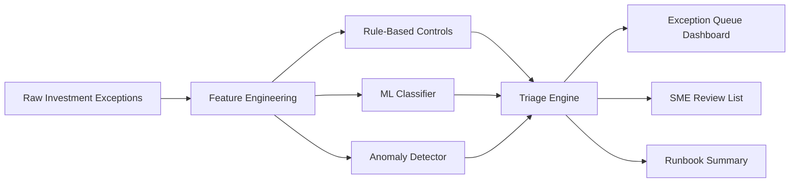

# AI-Powered Data Exception Triage System

Python | SQL | Pandas | Scikit-learn | Streamlit | Plotly | Data Management Automation

## Resume Summary

- Developed a Python-based exception triage engine to classify recurring data issues, detect anomalies and outliers, and prioritize breaks using rule-based checks and machine learning models.
- Implemented smart matching and reconciliation logic for trades, positions, prices, and reference data using fuzzy matching, clustering, and confidence scoring.
- Generated explainable exception summaries and SOP-ready runbook notes, helping convert operational noise into actionable insights for analysts and SMEs.

## Goal

Build a polished AI-assisted operations tool that helps investment data analysts triage recurring data exceptions faster. The project should combine deterministic controls with machine learning accelerators to classify issues, detect anomalies, recommend owners, and summarize root causes.

The final product should show how Python and AI/ML can improve data management workflows beyond low-code automation.

## Target Users

- Investment data management analysts
- Reconciliation and exception-management teams
- Operations SMEs
- Data governance teams
- Hiring managers reviewing practical AI/ML use in financial data operations

## Business Problem

Investment data operations teams receive many recurring exceptions:

- Missing or stale security reference data
- Unmatched trades
- Position reconciliation breaks
- Price spikes or stale market prices
- Invalid client or portfolio mappings
- Delayed source-system loads
- Duplicate records
- Repeated manual follow-ups

Manual triage is slow because analysts must identify issue type, severity, owner, likely root cause, SLA priority, and recommended action. This project creates a prototype that automates that first-pass triage.

## Recommended Tech Stack

- Python 3.11+
- Pandas and NumPy for data preparation
- Scikit-learn for classification, clustering, anomaly detection, and model evaluation
- RapidFuzz for fuzzy matching
- SQLite for local demo persistence
- Streamlit for the dashboard
- Plotly for interactive visuals
- Pytest for tests
- Joblib for saved models

Optional upgrades:

- SHAP for explainability
- DuckDB for analytical queries
- MLflow for experiment tracking
- OpenAI-compatible local summarization layer if API access is approved later

## Project Structure

```text
ai-data-exception-triage/
├── README.md
├── requirements.txt
├── app.py
├── data/
│   ├── raw/
│   │   ├── trades.csv
│   │   ├── positions.csv
│   │   ├── prices.csv
│   │   ├── securities.csv
│   │   └── historical_exceptions.csv
│   ├── processed/
│   │   ├── triaged_exceptions.csv
│   │   ├── anomaly_scores.csv
│   │   ├── smart_match_results.csv
│   │   └── model_metrics.csv
│   └── exception_triage.db
├── docs/
│   ├── model_card.md
│   ├── data_dictionary.md
│   ├── exception_taxonomy.md
│   ├── triage_runbook.md
│   └── governance_notes.md
├── models/
│   ├── exception_classifier.joblib
│   ├── anomaly_detector.joblib
│   └── owner_recommender.joblib
├── notebooks/
│   └── model_exploration.ipynb
├── sql/
│   ├── schema.sql
│   ├── exception_features.sql
│   └── triage_reporting_views.sql
├── src/
│   ├── __init__.py
│   ├── config.py
│   ├── generate_synthetic_data.py
│   ├── feature_engineering.py
│   ├── train_exception_classifier.py
│   ├── anomaly_detection.py
│   ├── smart_matching.py
│   ├── triage_engine.py
│   ├── summarizer.py
│   └── dashboard_data.py
├── tests/
│   ├── test_feature_engineering.py
│   ├── test_smart_matching.py
│   ├── test_triage_engine.py
│   └── test_anomaly_detection.py
└── .github/
    └── workflows/
        └── ci.yml
```

## Exception Taxonomy

The project should classify exceptions into these categories:

- Missing Reference Data
- Stale Price
- Price Outlier
- Trade Match Break
- Position Reconciliation Break
- Duplicate Record
- Invalid Currency
- Missing Client Mapping
- Delayed Source Load
- Performance Return Outlier
- Unknown / Needs SME Review

## Synthetic Data Requirements

Generate realistic demo data for:

- Securities with ISINs, tickers, asset classes, currencies, exchanges, and issuers
- Trades with trade dates, settlement dates, quantities, prices, and statuses
- Positions with client, portfolio, security, quantity, market value, and source system
- Prices with daily market prices and vendor details
- Historical exceptions with issue type, severity, root cause, owner, SLA, age, and resolution label

Inject controlled issues:

- Missing ISINs
- Duplicate trades
- Stale prices
- Price spikes
- Negative quantities where invalid
- Currency mismatches
- Unmatched security IDs
- Delayed source-system loads
- Aging unresolved exceptions

## Machine Learning Components

### Exception Classifier

Goal: Predict exception category from structured features.

Suggested model:

- Logistic Regression baseline
- Random Forest or Gradient Boosting improved model

Features:

- Domain
- Source system
- Region
- Asset class
- Missing field count
- Age in days
- Break amount
- Price movement percentage
- Duplicate flag
- Currency mismatch flag
- Refresh delay hours

Metrics:

- Accuracy
- Macro F1
- Per-class precision and recall
- Confusion matrix

### Anomaly Detector

Goal: Identify unusual price, return, and reconciliation patterns.

Suggested model:

- Isolation Forest
- Z-score baseline

Outputs:

- Anomaly score
- Anomaly flag
- Reason code
- Severity recommendation

### Smart Matching Engine

Goal: Match records when exact keys are missing or inconsistent.

Use cases:

- Match trade security names to security master records
- Match vendor ticker variants
- Match client or portfolio name variants

Suggested approach:

- Normalize strings
- Use RapidFuzz token similarity
- Add exact-match boosts for ISIN, ticker, currency, and exchange
- Return match confidence and review flag

### Owner Recommender

Goal: Recommend the correct owner/team for each exception.

Suggested approach:

- Rule-based baseline from domain, region, and source system
- ML classifier trained on historical exception ownership
- Confidence score and fallback to SME review

## Triage Engine Logic

The triage engine should produce:

- Predicted exception type
- Severity
- Priority score
- Owner recommendation
- SLA status
- Root-cause hint
- Recommended next action
- Confidence score
- SME review flag

Priority score formula example:

```text
priority_score =
    severity_weight * 0.35
  + sla_breach_weight * 0.25
  + break_amount_weight * 0.20
  + recurrence_weight * 0.10
  + confidence_adjustment * 0.10
```

## Dashboard Requirements

The dashboard must be visually polished and demo-friendly.

### Visual Style

- Professional operations command-center feel
- Clean typography
- Strong status colors without clutter
- Clear cards, filters, and drill-down tables
- Interactive Plotly charts
- Explainable AI panels, not black-box outputs

### Required Pages

1. Triage Overview
2. Exception Queue
3. Anomaly Detection
4. Smart Matching
5. Model Performance
6. Governance and Explainability

### Triage Overview

Include:

- Total exceptions processed
- Auto-triaged percentage
- High-priority exceptions
- SLA breaches
- Average confidence score
- Estimated manual effort saved
- Exception trend over time
- Exception mix by category

Suggested visuals:

- KPI cards
- Stacked bar by severity
- Trend line of exceptions by day
- Donut chart by exception category
- Owner workload bar chart

### Exception Queue

Include:

- Searchable exception table
- Predicted type
- Severity
- Priority score
- Owner
- Confidence score
- Recommended action
- SME review flag

Suggested interactions:

- Filter by severity, owner, domain, confidence, SLA status
- Sort by priority score
- Show detail panel for selected exception

### Anomaly Detection

Include:

- Price anomalies
- Return outliers
- Reconciliation break outliers
- Anomaly reason codes

Suggested visuals:

- Scatter plot of price movement versus anomaly score
- Time-series chart with highlighted anomalies
- Top anomaly table

### Smart Matching

Include:

- Candidate matches
- Match confidence
- Exact/fuzzy feature comparison
- Review-needed flag

Suggested visuals:

- Match confidence distribution
- Candidate comparison table
- False-positive risk indicator

### Model Performance

Include:

- Accuracy
- Macro F1
- Class-level precision and recall
- Confusion matrix
- Model version
- Training data snapshot date

Suggested visuals:

- Confusion matrix heatmap
- Per-class F1 bar chart
- Confidence distribution

### Governance and Explainability

Include:

- Model limitations
- Human-in-the-loop review rules
- Data privacy assumptions
- Validation controls
- Audit log of triage runs

Suggested visual:



## Documentation Requirements

Create these files:

- `docs/model_card.md`: model purpose, training data, metrics, limitations, intended use, non-intended use.
- `docs/data_dictionary.md`: fields, types, definitions, owners, refresh cadence.
- `docs/exception_taxonomy.md`: category definitions and examples.
- `docs/triage_runbook.md`: how analysts should interpret and act on results.
- `docs/governance_notes.md`: privacy, explainability, SME validation, audit controls.

## Implementation Plan

### Phase 1: Synthetic Data

- Generate raw datasets and historical exceptions.
- Include labeled examples for each exception type.
- Inject realistic noise and edge cases.

### Phase 2: Feature Engineering

- Build features for missingness, freshness, break amount, price movement, duplicate risk, owner history, and source-system delay.
- Persist processed features for reproducible training.

### Phase 3: Model Training

- Train baseline classifier.
- Train improved classifier.
- Evaluate model with confusion matrix and class metrics.
- Save model artifacts to `models/`.

### Phase 4: Triage Engine

- Combine deterministic rules, model predictions, anomaly scores, and smart matching.
- Generate recommended action and owner.
- Flag low-confidence results for SME review.

### Phase 5: Dashboard

- Build multi-page Streamlit dashboard.
- Add polished executive metrics and interactive visuals.
- Add detail panels for selected exceptions.
- Include explainability and governance page.

### Phase 6: Tests and CI

- Test feature creation.
- Test matching thresholds.
- Test priority score logic.
- Test anomaly flagging.
- Add GitHub Actions workflow.

## Success Criteria

- `python src/generate_synthetic_data.py` creates realistic input data.
- `python src/train_exception_classifier.py` trains and saves model artifacts.
- `python src/triage_engine.py` creates `data/processed/triaged_exceptions.csv`.
- `streamlit run app.py` launches a polished dashboard.
- Dashboard includes clear KPI cards, exception queue, anomaly charts, smart matching view, and model performance page.
- Documentation explains model purpose, limitations, governance controls, and analyst runbook.
- Tests pass with `pytest`.

## Example Dashboard KPIs

- Exceptions Processed: 8,500
- Auto-Triaged: 78%
- SME Review Required: 22%
- High Priority Exceptions: 143
- SLA Breaches: 37
- Average Confidence: 86%
- Estimated Manual Hours Saved: 42
- Macro F1 Score: 0.84

## Suggested Demo Script

1. Open the Triage Overview page and show how many exceptions were auto-triaged.
2. Filter the queue to high-priority SLA breaches.
3. Select an exception and explain predicted type, owner, confidence, and recommended action.
4. Show the Anomaly Detection page and explain why a price or return was flagged.
5. Show Smart Matching and explain match confidence.
6. Show Model Performance and Governance to demonstrate responsible AI handling.

## Why This Project Fits Investment Data Management

This project demonstrates augmented data management: AI/ML-assisted classification, anomaly detection, smart matching, triage automation, explainability, governance, and operational dashboarding. It aligns with investment data workflows while remaining realistic, auditable, and resume-ready.
